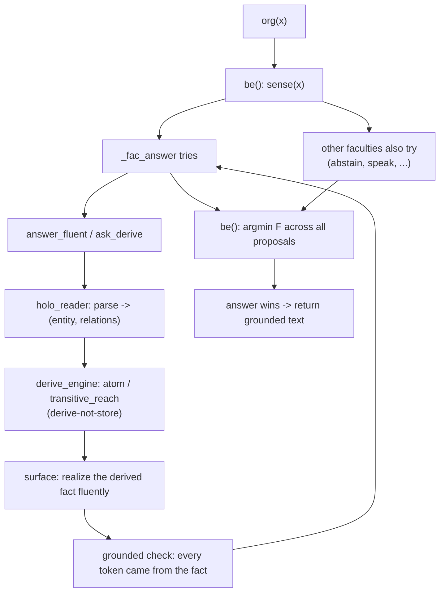
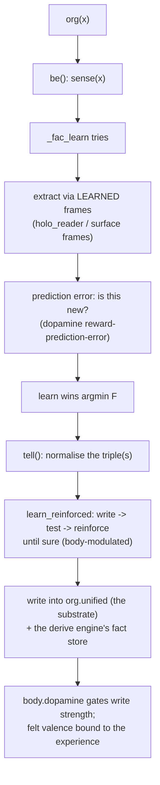

# Architecture: how the parts interact

This is the map for a new collaborator. The repo is big, but the number of ideas
you have to hold in your head to follow a single query is small. This page walks
one input through the whole organism and names who does what.

> If you only read one thing: **everything goes through `org(x)`**, and `org(x)`
> does **not** classify the input and branch. Every faculty *tries*, each reports a
> measured confidence, and the organism picks the best. That one decision explains
> the whole shape of the code.

---

## The one hub

`IkigaiOrganism` in [`integrate.py`](../integrate.py) is the whole organism. It owns
the memory, the reasoning engine, the body, the reader, and the generator, and it
exposes exactly one front door:

```python
org(x)   #  == org.__call__(x)  == org.be(x)
```

Everything else is a subsystem it calls. The subsystems are lazily built the first
time they're used (`@property` accessors), so importing the class is cheap.

---

## The decision loop (the heart)

`org(x)` is `be(x)`, and `be` is short:

```
be(x):
  props = sense(x)                 # every faculty tries x, reports (name, payload, F)
  pick the proposal with the LOWEST free energy F   (ties broken by name, not order)
  if the winner is 'learn', actually learn; otherwise return its answer
  bind the body's felt emotion onto the experience
```

`sense(x)` ([integrate.py](../integrate.py) ~line 270) is the anti-cheat. It does
**not** look at the shape of the input. It runs *every* faculty and keeps the ones
that report they can do something:

```python
for name, fn in self._FACULTIES:
    p = fn(self, x)                       # the faculty tries the RAW input
    if p:                                 # (confidence, payload)
        props.append((name, payload, surprise(confidence)))
```

`F` (free energy) is just `-log(confidence)`: low F = high confidence. The organism
picks `argmin F`. Change what the organism *knows* and the winner changes; shuffle
the order faculties were registered and nothing changes. That property is tested
(`day99_dispatch_order_invariant`).

### The faculties

Each is a method `_fac_*` registered by name. Every one takes the raw input and
returns `(confidence, payload)` or `None`.

| Faculty | Wins when... | Calls into |
|---|---|---|
| `answer` | it can *derive & ground* an answer | `answer_fluent` / `ask_derive` -> derive engine + reader |
| `learn` | the input carries a fact it doesn't already hold | `tell` -> `learn_reinforced` (body-modulated) |
| `abstain` | nothing else clears the calibrated noise floor | calibration boundary |
| `speak` | it recognises the topic and can say something grounded | reader + surface realizer |
| `wonder` | there's an informative gap worth a question | derive engine (missing atoms) |
| `solve` | the input is a solvable problem (e.g. arithmetic) | general reasoner |
| `analogy` | an A:B::C:? completion is derivable | derive engine (`analogy`) |
| `identity` | it's being asked who/what it is | `identity_statement` (the one innate, authored part) |

"abstain can win" is the whole no-hallucination story: **"I don't know" is a
faculty competing on the same scale as answering**, so when nothing grounds, silence
wins honestly.

---

## The subsystems

All of these hang off the organism and share **one identity space** (a single
`ComputedKey`, `ck`), so a word has the same vector everywhere.

| Accessor | Lives in | What it is |
|---|---|---|
| `org.unified` | `ikigai/cognition/multirole_memory.py` | **The substrate.** A vector-symbolic memory (Kanerva SDM, 8 banks, ~65 named roles). Everything durable is written here in superposition. Fixed size. |
| `org.general_reasoner.derive_engine` | `ikigai/cognition/compositional.py` | **The derive engine** (`CompositionEngine`). Derive-not-store: `atom(rel, x)`, `transitive_reach`, inheritance, discovered rules. This is where reasoning happens. |
| `org.body` | `ikigai/body.py` | **The body.** Neurons + neuromodulators + HPA stress axis (dopamine, cortisol, serotonin, oxytocin...). Modulates how strongly things are learned and supplies felt valence. |
| `org.holo_reader` | `ikigai/cognition/holo_read.py` | **The reader.** Template-free: parses a plain-English question into (entity, relations), and reads messy text into candidate `(subject, relation, object)` atoms. FHRR bind/unbind over an SDM bank. |
| `org.surface` | `ikigai/cognition/holo_generate.py` | **The generator** (`SurfaceRealizer`). Realizes a derived fact as a fluent sentence using frames it *learned* per relation. Content-blind: it can only place tokens that came from the fact. |
| `org.mem` | `ikigai/cognition/unified_memory.py` | A single facade over the substrate (`similar`/`relate`/`fact`/`kv_*`) unifying semantic, relational, and exact-fact access on the shared `ck`. |
| `org.being`, `org.frames` | `integrate.py` init | The self-model (`IkigaiBeing`) and the frame field used by generation. |

Grammar is **learned, not configured**: function words come from corpus frequency,
question words from what precedes a `?`, relation frames by self-consistency. See
[HOW_IT_WORKS.md](HOW_IT_WORKS.md) §5. The learned grammar persists with the body.

---

## Two end-to-end flows

### Asking a question — `org('what is the capital of france')`



The key point: `_fac_answer` reports **confidence 1.0 only if the answer is
grounded** (every content token traces to a derived fact). If the derive engine
can't ground it, `answer` reports nothing, and `abstain` wins instead. Multi-hop
questions ("is a cat an animal") derive the transitive closure here too, when the
relation was discovered transitive — see [API.md](API.md#multi-hop-derivation).

### Teaching a fact — `org('the capital of qualan is mendaro')`



There's no separate training step. The write strength is modulated by the body: a
novel or emotionally salient fact reinforces harder (survives), a mundane one fades.
`learn_reinforced` re-tests itself and stops when mastered, or reports it isn't sure
— it won't claim to know something it hasn't locked in.

---

## Persistence — what's durable vs ephemeral

`org.save_ikg(path)` / `org.load_ikg(path)` serialize the organism to an `.ikg` file.

- **Durable (rides the `.ikg`):** the `unified` substrate (all roles: relations,
  taxonomy, sensory grounding, POS context, affect...), the derive engine's fact
  store, and the learned grammar/frames. A role written into `unified` survives
  save -> reload byte-identical.
- **Ephemeral (rebuilt on demand):** LRU/index caches (LSH/IVF). Correct to drop —
  they're derivable from the substrate.

`organism.ikg` (the shipped body) is **load-only**: `save_ikg` refuses to overwrite
it without `allow_production=True`, a guard against clobbering the trained brain.

---

## The wild server (the live deployment)

[`experiments/wild/serve.py`](../experiments/wild/serve.py) is a thin HTTP wrapper
around `org(x)`. It boots the organism, and for each request calls `org(text)`,
applies **correct-or-abstain discipline** at the public door (only grounded
faculties are shown; anything else becomes "i don't know"), learns from the input
inside `org(x)`, and persists its accumulated wild life to a **separate** file
(`wild_organism.ikg`) so the production body stays read-only. It's threaded with a
hang/RSS watchdog so one pathological input can't take the service down. Full deploy
guide: [DEPLOY.md](../experiments/wild/DEPLOY.md).

---

## Where to start reading

If you want to trace real code, in this order:

1. **`be` and `sense`** in [integrate.py](../integrate.py) (~lines 270, 907) — the
   whole decision loop, ~60 lines. Everything else is a faculty or a subsystem.
2. **`_fac_answer`** (~line 405) and the `answer` / `ask_derive` methods — the
   grounded read-out path.
3. **`compositional.py`** — `atom`, `transitive_reach`, `is_transitive`. The
   derive-not-store engine, standalone and readable.
4. **`benchmark.py`** — every headline claim as a runnable check; a good index of
   what the organism is supposed to do.

A genuinely minimal core (derive + honest-abstain in a few hundred lines, no body,
no faculties) is planned to make this even easier to pick up — ask if it's landed.
