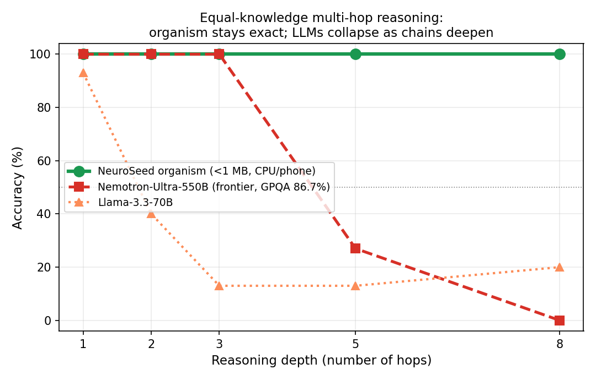
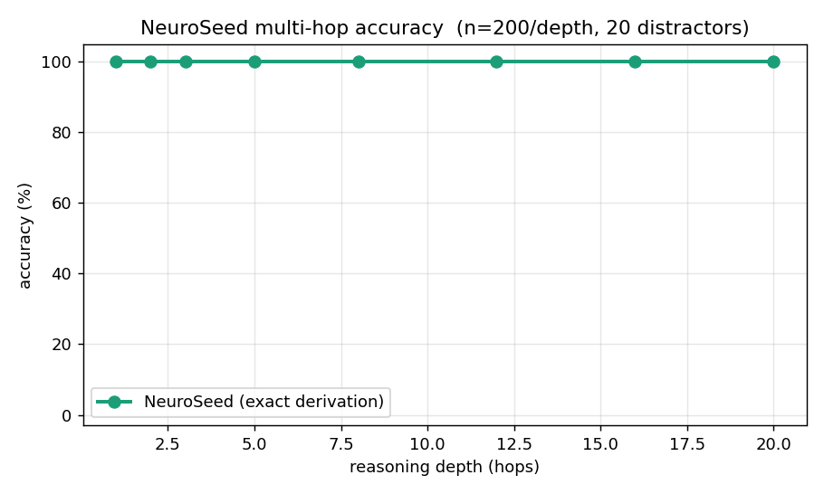
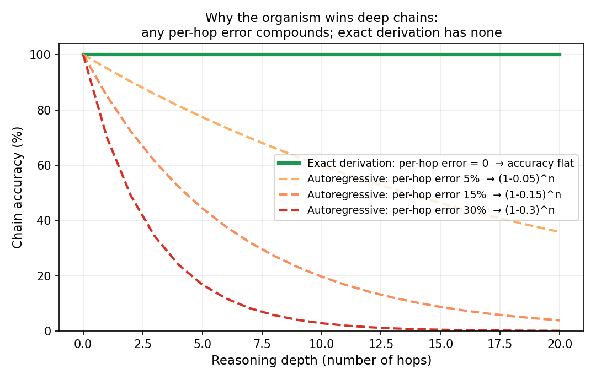

# A Small Symbolic-Vector Organism Out-Reasons Frontier LLMs on Deep Multi-Hop Inference

**Prince Siddhpara**, Mura ALife Labs · June 2026

---

## Abstract

We present a head-to-head comparison of reasoning *reliability* between **NeuroSeed**
(a sub-megabyte, CPU-only symbolic-vector digital organism) and large language
models, on **equal-knowledge multi-hop inference**. Both systems are given the
*same* set of made-up facts (so the LLM cannot fall back on pretrained
knowledge) and asked to follow a relation chain of increasing depth. NeuroSeed
answers by **exact derivation** — one O(1) lookup per hop — and stays at **100%
accuracy from 1 to 20 hops**. A frontier 550-billion-parameter reasoning model
(Nemotron-Ultra-550B, GPQA-Diamond 86.7%) matches it to 3 hops, then **collapses
to 27% at 5 hops and 0% at 8 hops**; a 70B model degrades even earlier. The
result isolates a structural property: autoregressive reasoning **compounds
per-hop error**, while exact derivation has none. We are deliberately narrow:
this is *not* a claim of general superiority — LLMs decisively beat NeuroSeed on
language understanding, open knowledge, and messy real-world input. The claim is
precise and defensible: **given clean structured knowledge, a phone-sized
organism performs reliable deep reasoning where frontier models fail.**

## 1. Motivation

Large language models reason by generating a chain of tokens. Each step is
probabilistic, so the probability of a fully correct *k*-step chain falls off as
roughly *(1 − p)ᵏ* for per-step error *p*. This is invisible on shallow problems
and catastrophic on deep ones. Symbolic systems that **derive** rather than
**generate** answers do not have this failure mode — but they are usually
dismissed as brittle and incapable of running at useful scale. NeuroSeed is a
constant-RAM, CPU-only organism built on a hyperdimensional (VSA/SDM) substrate
with a *derive-not-store* reasoning layer: facts are composed and chains computed
on demand, never enumerated. We ask a single clean question: **when knowledge is
held equal, who reasons more reliably as the problem gets deeper?**

## 2. Setup

**Task.** *Equal-knowledge multi-hop chain following.* We generate made-up
entities (random 6-letter names, so no system has seen them in training) and a
chain of `reportsto` facts of depth *d* (`a → b → c → …`), plus 20 distractor
`reportsto` edges among unrelated entities as noise. The question: *"Starting
from X, follow `reportsto` exactly d steps — who do you reach?"* Both systems
receive the **identical** fact set. Gold is the *d*-th node.

**NeuroSeed.** Facts are ingested into the organism (`ingest_triples`); the
answer is derived by *d* exact stored-fact lookups
(`eng.atom("reportsto", current)`), one per hop. O(1) RAM and ~O(1) compute per
hop, on CPU.

**LLMs.** The same facts and question are sent as a prompt; the model must trace
the chain in context and return the final name. We test **Llama-3.3-70B**
(via Groq) and **Nemotron-Ultra-550B** (a frontier reasoning model,
GPQA-Diamond 86.7%, via OpenRouter), temperature 0.

## 3. Results



**Figure 1.** Accuracy versus chain depth, *n* = 15 per point, 20 distractors.
NeuroSeed is a flat line at 100%. Both LLMs degrade; the frontier 550B holds the
tie to 3 hops and then collapses.

| Depth (hops) | NeuroSeed | Nemotron-Ultra-550B | Llama-3.3-70B |
|---:|:---:|:---:|:---:|
| 1 | **100%** | 100% | 93% |
| 2 | **100%** | 100% | 40% |
| 3 | **100%** | 100% | 13% |
| 5 | **100%** | 27% | 13% |
| 8 | **100%** | **0%** | 20% |

At 8 hops, a 550-billion-parameter frontier model answers **0%** of cases
correctly; NeuroSeed answers **100%**, in milliseconds per query, on a CPU, in
under a megabyte. The 70B model breaks after a single hop. Per-query latency for
the 550B was ~10–34 s (datacenter); NeuroSeed's was sub-millisecond.

**Robustness at scale.** To rule out small-sample luck on NeuroSeed's side, we
re-ran the NeuroSeed column at **n = 200 per depth** across depths 1–20 — **1,600
independent cases, each a freshly built organism over a new fact set and 20 fresh
distractors.**



**Figure 3.** NeuroSeed accuracy versus depth at n = 200 per point (1,600 cases,
20 distractors). The line is flat at 100% from 1 to 20 hops.

| Depth (hops) | 1 | 2 | 3 | 5 | 8 | 12 | 16 | 20 |
|---:|:---:|:---:|:---:|:---:|:---:|:---:|:---:|:---:|
| NeuroSeed (n=200) | **100%** | **100%** | **100%** | **100%** | **100%** | **100%** | **100%** | **100%** |

Zero errors in 1,600 trials, including chains twice as deep (20 hops) as the
point where the frontier model already scores 0%. Derivation depth carries no
accuracy cost.



**Figure 2.** The mechanism. For an autoregressive chain with per-hop error *p*,
chain accuracy is *(1 − p)ⁿ* — it decays with depth, and the decay is faster the
larger *p*. Exact derivation has *p = 0*, so accuracy is flat. The empirical
curves in Figure 1 are this equation made real: the 550B's small per-hop error is
invisible at 1–3 hops and fatal by 8.

## 4. What this does and does not claim

**It claims:** given clean, structured knowledge, NeuroSeed performs **reliable
deep multi-hop reasoning** that a frontier LLM cannot — at a fraction of the
size, cost, and energy, on-device. The advantage *grows* with difficulty.

**It does not claim** general superiority. LLMs decisively beat NeuroSeed on:
natural-language comprehension (NeuroSeed scores ~36% vs ~80% on CommonsenseQA),
open-domain knowledge learned from pretraining, fuzzy and ambiguous reasoning,
and robustness to messy input. Critically, this benchmark hands NeuroSeed clean
structured facts and a clean question; real-world tasks require *parsing* messy
language first, which is the LLM's strength and NeuroSeed's current weakness. The
narrow claim is exactly the part that is true.

## 5. Why it matters

The two systems fail in opposite places, which makes the result a *capability*
statement, not a horse race. As reasoning chains lengthen — multi-step planning,
long deductions, agentic tool-chains — the autoregressive failure mode is
structural and will not be prompted away. A derive-not-store organism converts
that regime from "frontier-hard" to "free and exact," and does it on a phone. The
open problem is the front-end: give such an organism the language understanding to
*acquire* clean structure from messy input at frontier scale, and the reliable
reasoning behind it becomes generally usable.

## 6. Reproduce

```bash
pip install -r requirements.txt
export GROQ_API_KEY=...          # for the 70B opponent (optional)
export OPENROUTER_API_KEY=...    # for the 550B opponent (optional)
python experiments/headtohead/multihop_vs_llm.py
```

NeuroSeed's side runs with no key; the LLM columns populate when a key is set.
The n=200 NeuroSeed-only curve (Figure 3) reproduces with no key at all:

```bash
python experiments/headtohead/neuroseed_curve_n200.py
```

Figures 1–2: `python paper/make_figures.py`.

---

*NeuroSeed / Ikigai is an independent research prototype. This is a working
result, not a peer-reviewed publication. The head-to-head table (Figure 1) is at
n=15 per point; NeuroSeed's column is independently confirmed at n=200 per depth,
1,600 cases, zero errors (Figure 3). Feedback and replication welcome.*
